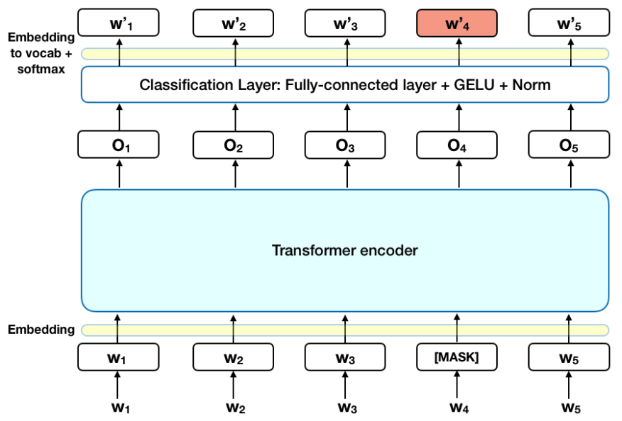

---
language:
- zh
tags:
- bert
- pytorch
- zh
- ner
license: apache-2.0
pipeline_tag: token-classification
widget:
  - text: 常建良，男，1963年出生，工科学士，高级工程师
---

# BERT for Chinese Named Entity Recognition(bert4ner) Model
中文实体识别模型

`bert4ner-base-chinese` evaluate PEOPLE(人民日报) test data：

The overall performance of BERT on people **test**:

|              | Accuracy  | Recall    | F1  |
| ------------ | ------------------ | ------------------ | ------------------ |
| BertSoftmax | 0.9425     | 0.9627   | 0.9525     |

在PEOPLE的测试集上达到接近SOTA水平。

BertSoftmax的网络结构(原生BERT)：



## Usage

本项目开源在实体识别项目：[nerpy](https://github.com/shibing624/nerpy)，可支持bert4ner模型，通过如下命令调用：

```shell
>>> from nerpy import NERModel
>>> model = NERModel("bert", "shibing624/bert4ner-base-chinese")
>>> predictions, raw_outputs, entities = model.predict(["常建良，男，1963年出生，工科学士，高级工程师"], split_on_space=False)
entities: [('常建良', 'PER'), ('1963年', 'TIME')]
```

模型文件组成：
```
bert4ner-base-chinese
    ├── config.json
    ├── model_args.json
    ├── pytorch_model.bin
    ├── special_tokens_map.json
    ├── tokenizer_config.json
    └── vocab.txt
```

## Usage (HuggingFace Transformers)
Without [nerpy](https://github.com/shibing624/nerpy), you can use the model like this: 

First, you pass your input through the transformer model, then you have to apply the bio tag to get the entity words.

Install package:
```
pip install transformers seqeval
```

```python
import os
import torch
from transformers import AutoTokenizer, AutoModelForTokenClassification
from seqeval.metrics.sequence_labeling import get_entities

os.environ["KMP_DUPLICATE_LIB_OK"] = "TRUE"

# Load model from HuggingFace Hub
tokenizer = AutoTokenizer.from_pretrained("shibing624/bert4ner-base-chinese")
model = AutoModelForTokenClassification.from_pretrained("shibing624/bert4ner-base-chinese")
label_list = ['I-ORG', 'B-LOC', 'O', 'B-ORG', 'I-LOC', 'I-PER', 'B-TIME', 'I-TIME', 'B-PER']

sentence = "王宏伟来自北京，是个警察，喜欢去王府井游玩儿。"


def get_entity(sentence):
    tokens = tokenizer.tokenize(sentence)
    inputs = tokenizer.encode(sentence, return_tensors="pt")
    with torch.no_grad():
        outputs = model(inputs).logits
    predictions = torch.argmax(outputs, dim=2)
    char_tags = [(token, label_list[prediction]) for token, prediction in zip(tokens, predictions[0].numpy())][1:-1]
    print(sentence)
    print(char_tags)

    pred_labels = [i[1] for i in char_tags]
    entities = []
    line_entities = get_entities(pred_labels)
    for i in line_entities:
        word = sentence[i[1]: i[2] + 1]
        entity_type = i[0]
        entities.append((word, entity_type))

    print("Sentence entity:")
    print(entities)


get_entity(sentence)
```

output:
```shell
王宏伟来自北京，是个警察，喜欢去王府井游玩儿。
[('王', 'B-PER'), ('宏', 'I-PER'), ('伟', 'I-PER'), ('来', 'O'), ('自', 'O'), ('北', 'B-LOC'), ('京', 'I-LOC'), ('，', 'O'), ('是', 'O'), ('个', 'O'), ('警', 'O'), ('察', 'O'), ('，', 'O'), ('喜', 'O'), ('欢', 'O'), ('去', 'O'), ('王', 'B-LOC'), ('府', 'I-LOC'), ('井', 'I-LOC'), ('游', 'O'), ('玩', 'O'), ('儿', 'O'), ('。', 'O')]
Sentence entity:
[('王宏伟', 'PER'), ('北京', 'LOC'), ('王府井', 'LOC')]
```


### 训练数据集
#### 中文实体识别数据集


| 数据集 | 语料 | 下载链接 | 文件大小 |
| :------- | :--------- | :---------: | :---------: |
| **`CNER中文实体识别数据集`** | CNER(12万字) | [CNER github](https://github.com/shibing624/nerpy/tree/main/examples/data/cner)| 1.1MB |
| **`PEOPLE中文实体识别数据集`** | 人民日报数据集（200万字） | [PEOPLE github](https://github.com/shibing624/nerpy/tree/main/examples/data/people)| 12.8MB |


CNER中文实体识别数据集，数据格式：

```text
美	B-LOC
国	I-LOC
的	O
华	B-PER
莱	I-PER
士	I-PER

我	O
跟	O
他	O
```


如果需要训练bert4ner，请参考[https://github.com/shibing624/nerpy/tree/main/examples](https://github.com/shibing624/nerpy/tree/main/examples)


## Citation

```latex
@software{nerpy,
  author = {Xu Ming},
  title = {nerpy: Named Entity Recognition toolkit},
  year = {2022},
  url = {https://github.com/shibing624/nerpy},
}
```